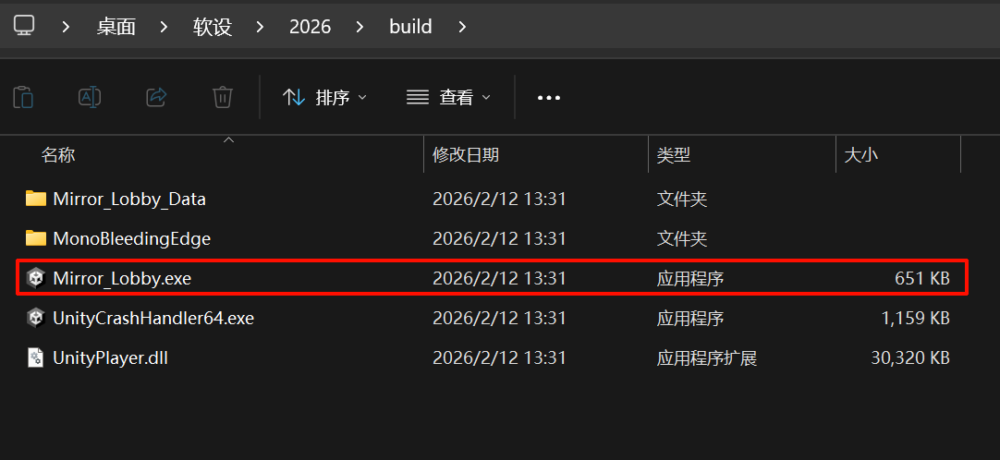
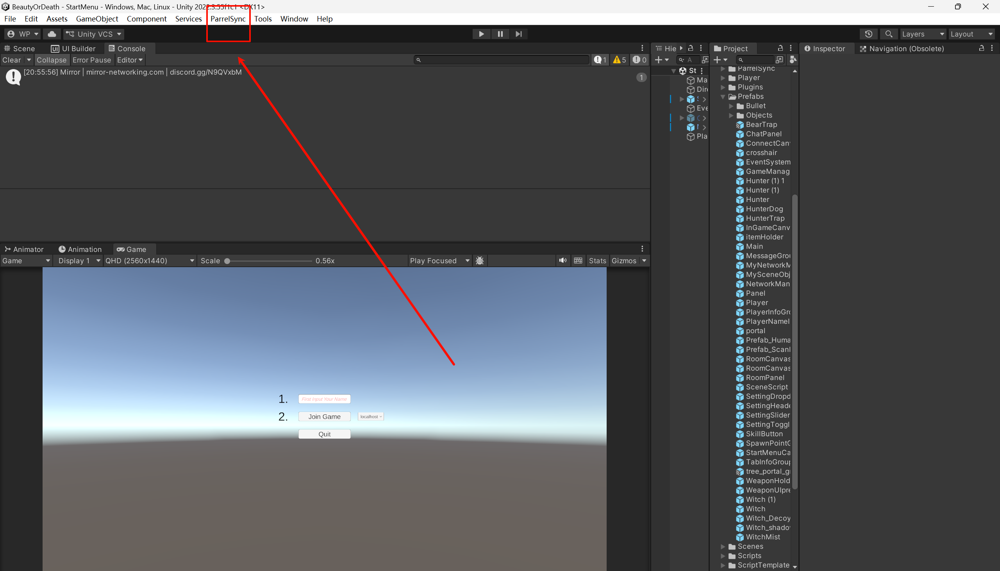
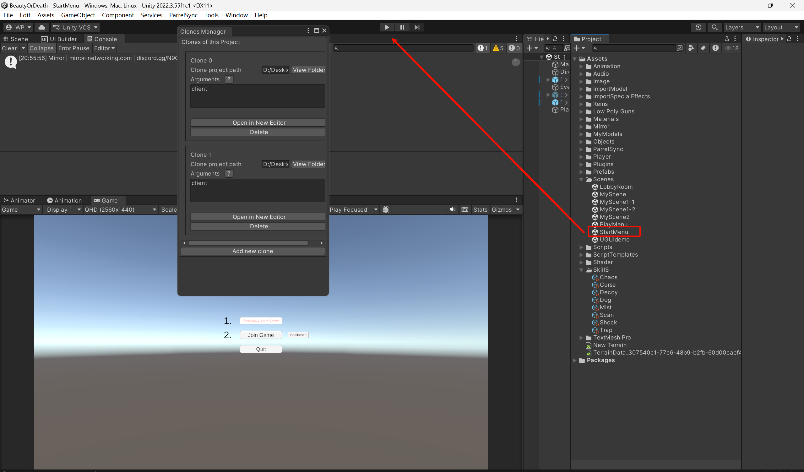

1. 点进主项目
2. 左上角 File->Build Settings->Dedicated Server  TargetPlatform选择 Win/Mac 然后 Switch Platform
3. Build 

4.  点开这个exe/ mac应该是其他后缀

5. Parallel Sync -> Clones Manager -> Add new clone -> Open in NEw Editor 
6. 每个Unity Editor 从Startmenu Scene 运行 

7. 然后就各自输入名字，ready，start